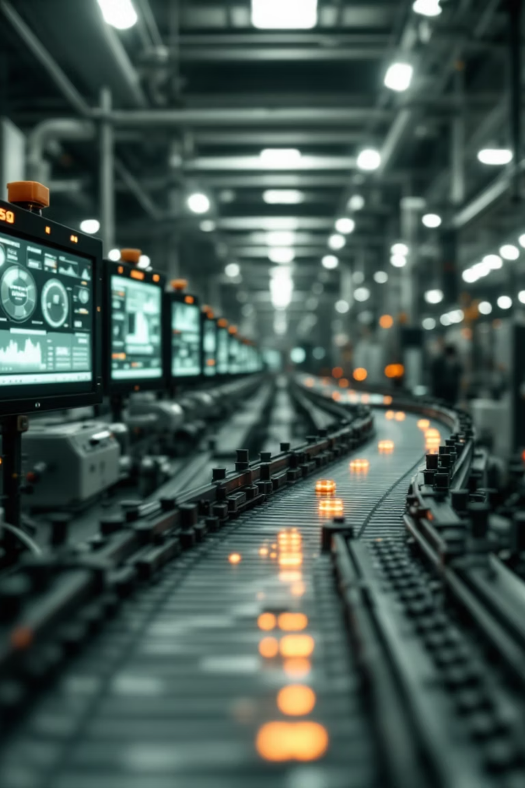

# POP(생산시점관리 프로그램)

기술스택:  
C#, Figma, MySQL, OpenCV, PLC, Python, WPF, Yolo

프로젝트 시작:  
2025년 7월 1일

마감 일자:  
2025년 7월 28일

인원: 
이승민, 유현수

# ✏️개요

---

# Why?

## <타겟>

- **스마트팩토리 공장**
- **QC(품질관리자)**   

## **1. 리드타임 단축**

**도입 전** : 불투명한 시간관리로 인해 자재투입부터 제품출하까지 시간이 길다.

**도입 후 :** **리드타임을 줄여** 효율적인 **생산률 증대**

## **2. 수율 향상**

**도입 전** : 불량품 발생시 불량품의 재료비, 공수, 설비상각비 등의 비용손실 및 양질제품 생산 가능 시간에 대한 기회손실 발생

**도입 후** : **인건비를 감소**시키고, **불량률을 감소**시킴으로써 **비용손실 및 기회손실 감소**

## **3. 보전비 삭감**

**도입 전** : 사후 보전은 확대 손실이나 기회 손실이 많아지기 때문에 예방 보전이 바람직

**도입 후** : **예방 보전**을 통해 **보전 비용 대폭 절감**

# What?

## Point of Production(생산시점관리)

- 품질관리 - 생산관리 - 설비관리 - 원가관리
- 불량검출
- PLC제어

# How?

## **1. C#(WPF, PLC) ↔ MySQL ↔ Python(OpenCV)**

## **2. Yolo 학습**

1차 검사 데이터

2차 검사 데이터

## 3. QR인식 + 불량검출

## **4. WPF → PLC 조작**

# 🎨디자인

---

# 🧠기획

---

[POP 기획서.pdf](Assets/POP_%EA%B8%B0%ED%9A%8D%EC%84%9C.pdf)

## <역할>

- **IVCam - OpenCV 소켓 통신,** **불량 검출**, **라벨링+딥러닝** 학습, **대쉬보드**, **생산 도식화**

# 🏗️전체 구조

---

- **딥러닝** 기반 영상 처리와 **불량 검출**, QR코드 제작은 **Python(OpenCV)**으로 수행, **설비 제어** 및 UI는 **C#(WPF)**로 구현
    - 각 **언어의 장점을 살린 구조**를 선택하였습니다.
- **Python**과 **C#** 간의 **데이터 연동**은 **MySQL**을 통해 중계
    - **하드웨어의 제어+실시간 차트 분석과 영상 분석을 효율적으로 분리**하여 시스템 **안정성과 확장성을 확보**했습니다.

- **DB구조**
    - product (제품)
        
        
        | Column명 | Data Type | 설명 |
        | --- | --- | --- |
        | qr_code | int (PK, NN) | 각 제품에 인쇄된 고유한 qrcode |
        | name | Varchar(30) | 제품명 |
        | status | Varchar(20) | 해당 제품의 현재 상태 (반제품/완제품) |
        | production_time | DateTime | 생산 시점 시각 |
        | defective_or_not | TinyInt | 불량 유무 |
    - defect (불량품)
        
        
        | Column명 | Data Type | 설명 |
        | --- | --- | --- |
        | qr_code | int (PK, NN) | 각 제품에 인쇄된 고유한 qrcode |
        | status | Varchar(20) | 해당 제품의 현재 상태 (반제품/완제품) |
        | time | Datetime | 불량품을 발견한 시각 |
        | location | Tinyint | 불량품을 발견한 위치 (검출 위치를 1/2로 표현) |
        | name | Varchar(20) | 제품명 |
        | class_defect | Varchar(20) | 불량 종류 |
    - facility (공정)
        
        
        | Column명 | Data Type | 설명 |
        | --- | --- | --- |
        | name | Varchar(20) (PK, NN) | 고유 설비 명칭 |
        | running_time | Int | 진행 시간 |
        | recent_check | DateTime | 최근 점검 날짜 |
        | manufacturer | Varchar(20) | 제조사 |
        | Model_name | Varchar(20) | 모델명 |
    - users (회원)
        
        
        | Column명 | Data Type | 설명 |
        | --- | --- | --- |
        | id | Varchar(PK, NN) | 고유 id |
        | pwd | Varchar(30) | 비밀번호 |
        | name | Varchar(30) | 이름 |
        | handover | Text | 인수인계 메모 |
    - condition (상태)
        
        
        | Column명 | Data Type | 설명 |
        | --- | --- | --- |
        | temperature | Double | 온도 |
        | humidity | Int | 습도 |
        | pollution | Double | 오염도 |
        | powerStability | TinyInt(1) | 전력 안정성 |
        | create_date | TimeStamp | 데이터 생성 날짜 |

# 📄기능 정의서

---

# 🌿브랜치 전략

---

| 브랜치명 | 작업 영역 | 역할 | 전략 |
| --- | --- | --- | --- |
| main |  | 최종 결과물을 담는 브랜치(realease) | 안정적인 코드만 유지하도록 주의 |
| main_develop |  | 각 브랜치 병합 후 main 이동 전 테스트 브랜치 | 각 브랜치에서 통합 완료 한 뒤 병합 |
| OPENCV |  | 불량 판별 처리 및 신호 전달 | 영상 인식
YOLO 학습 |
|  | OPENCV_sm |  | 각자 작업한 내용 푸쉬하기 |
|  | OPENCV_hs |  | 각자 작업한 내용 푸쉬하기 |
| PLC |  | 통신, 컨베이어 벨트 제어 | 벨트, 램프 제어 로직 기능 |
|  | PLC_conveyer |  | 컨베이어의 가동, 정지 … 속도 기능 |
|  | PLC_lamp |  | 제품 불량 판별로 램프 작동 방식 로직 |
| XAML |  | 전체 진행 상태와 DB로 불량 상태 시각화 | MVVM 구조, Repository 패턴 기반 ViewModel, DB 연동 |
|  | XAML_sm |  | 각자 작업한 내용 푸쉬하기 |
|  | XAML_hs |  | 각자 작업한 내용 푸쉬하기 |

# 🛠️트러블 슈팅

---

## 순환 참조

- 순환 참조가 일어나 서로 의존하는 관계가 만들어지며 Error가 생김
- **원인 : 서로 import**할 때 파이썬이 아직 **정의되지 않은 객체에 접근**하려 해서 발생
- **해결 : 불량검출**과 **QR코드 리더기 로직 기능 통합**

## QR코드 read 반복

- 1차 불량 검사 이후 2차 불량 검사 조건인 location이 1로 바뀌면서 2차 검사가 즉시 진행되는 오류
- **원인** : **1차 불량검사**와 **2차 불량검사**에 대한 **딜레이**가 없음
- **해결** : QR코드에 반제품/완제품을 미리 구별하여 DB에 Update 후 **반제품 → 1차 검사**만 진행 / **완제품 → 2차 검사**만 진행

## Git merge 및 충돌 문제

- merge 충돌 파일이 40개 이상 발생
- **원인** :
    - **.gitignore 설정 미흡** 및 불필요한 파일을 제외하지 않음
    - .vs, bin, obj 등의 빌드, 캐시 파일이 Github에 올라감
- **해결** : **git rm —cached 명령어로 Git에 스테이징 된 파일 삭제 및 .gitignore파일 수정**

# 🔁회고록

---

## 1. 실제 데이터 필요

- 실제 공장 내 다양한 센서들의 실측이 불가능 하여 더미 데이터로 도식화하였습니다. 이 경험을 통해 공장과 연동하고 시스템을 구축하며 기업과 연계하고 B2B 모델을 개발하여 사회에 도움이 되고 싶습니다.

## 2. 기능 확장

- 초기에 갑작스러운 인원 부족 및 지원 미비로 인해 기획했던 기능들을 다 구현하기에 한계가 있었습니다. 향후에는 컨베이어 속도, 방향 등의 추가 제어 기능, 불량품을 다른 라인으로 이동시키거나 제외하는 기능 등의 기능 확장을 통해 좀 더 완성도 있는 프로그램을 개발하고 싶습니다.

## 3. 신뢰도 최적화

- 다양한 데이터로 학습시켜 신뢰도를 높이기 어려움이 있었습니다. 간단한 PCB 만능기판을 사용하여 데이터셋이 부족하였고 roboflow를 사용한 데이터 증강을 하였지만 작은 기판 안에 수많은 부품을 영상처리하기엔 어려움을 느꼈습니다. 하지만 경험을 통해 딥러닝 학습과 데이터를 활용한 영상처리에 대해 감을 잡게 되었습니다.
